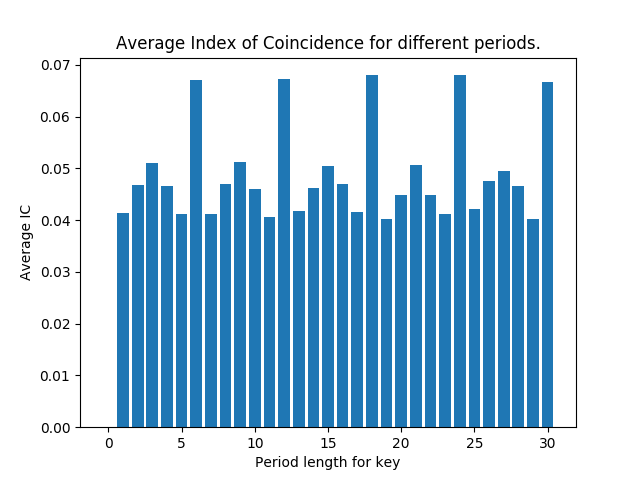

## Observations

The encrypted text is placed in 'encrypt_vigenere_cipher'. 

IC.py computes the average Index of Coincidence for different periods of key lengths.

The values attain maximum at multiples of 6. So the possible key lengths are 6, 12, 18, 24, 30.  
By using the chi squared statistic method(for period 6), we get the key to be DYBNMW.

The decrypted file is in 'decrypt_vigenere_cipher'
